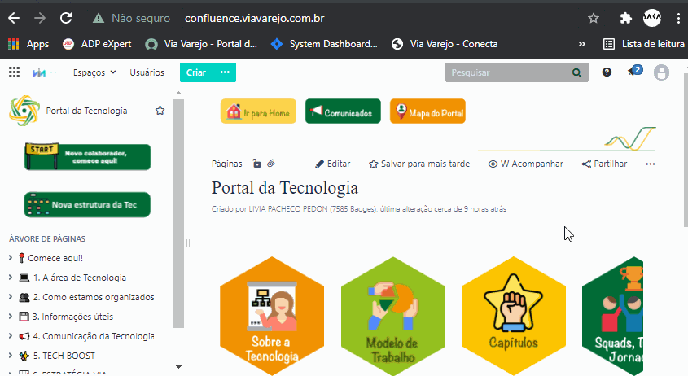

Bem vindo ao Publish-Confluence Demo!
=========================================

Essa demonstração cria uma forma de documentação as code utilizando pre-commits e docker

## Indice
- [Test in Folder](test1/README.md)

## Organização do Repositorio
```bash
/
├── README.md 		
├── CODEOWNERS 		# Arquivo para especificar code reviewers obrigatórios
└── docs	
    ├── README.md 		# Esse Arquivo
    ├── _static			# Onde estão os arquivos anexos e imagens
    │   └── GetSpaceKey.gif # Exemplo, favor remover quando utilizar em outro Repo
    ├── _templates				# Os arquivos de template devem estar aqui 	
    |						   # (https://www.sphinx-doc.org/en/master/templating.html)
    ├── sphinx-configuration.yaml # Arquivo de configuração do Sphinx
    └── test1	# Exemplo de Sub-pasta
        └── README.md # Documentação em uma Sub-pasta
```

## Começando
Para executar esse demo, será necessário instalar os seguintes requisitos:

[Docker](https://docs.docker.com/get-docker/)
[Git](https://git-scm.com/book/en/v2/Getting-Started-Installing-Git) (Provavelmente esse já esta instalado né? : )

## Configuração Inicial

Precisamos preparar o git para entender os hooks que colocamos para fazer o pre-commit, e necessario executar o comando abaixo:

```bash
git config core.hooksPath .githooks
```

Crie um novo arquivo .env na Raiz do Projeto e coloque as credenciais seguindo o modelo abaixo
Não se preocupe, esse arquivo estará no seu projeto mais não sera incluido nos commits.

```bash
# Put your username and password Here
INPUT_USERNAME=Put your user here! (Ex: 2105041759)
INPUT_APITOKEN=Put your password here! (Ex: !MyLargePasswordSecret!)
```

Edite o [sphinx-configuration.yaml](sphinx-configuration.yaml) para configurar o confluence no space que vc quer colocar!

```python
# -- Confluence Options ------------------------------------------------------
confluence_publish = True       # Quando 'True' ira fazer a publicação do documento
                                # Quando 'False' ira fazer todos os processos porem não envia ao Confluence

confluence_space_name = '~2105041759' # Nome do Espaço onde será distribuida a documentação
                                      # Quando for um Espaço Pessoal deve se utilizar a key de referencia
                                      # Clicando no Icone do Usuario -> Espaço pessoal
                                      # Copiar o viewspace.action?key=(xxxxx) 
                                      # Onde (xxxxxx) e sua chave de espaço (incluir tambem o ~)

confluence_server_url = 'http://confluence.viavarejo.com.br/' # Servidor do Confluence onde sera feita a publicação
                                                              
confluence_parent_page = 'Pagina de Suporte' # Configura qual pagina sera o suporte para colocar a documentação
                                             # Se estiver em branco, sera colocada na Raiz do Espaço
                                             # Eh necessario que a mesma esteja criada para ser utilizada
```

Assim terminamos a nossa configuração inicial.

## Como Fazer

**DICA:** Pode se testar sem publicar, alterando a flag 'confluence_publish' para False, seu namespace deve ser o mesmo que aparece na URL do confluence quando vc entra no space:

Ex: http://confluence.viavarejo.com.br/spaces/viewspace.action?key=~2105041759 (Onde ~2105041759 eh sua Key de Usuario)


Edite os arquivos .md (README.md) para preparar sua documentação
Coloque seus arquivos de imagem e anexos na pasta _static

Ao fazer um commit (git commit) o processo sera executado e sua documentação sera publicada no confluence !


## Referências:

[Myst Parser](https://myst-parser.readthedocs.io/en/latest/sphinx/use.html) - Plugin do Sphinx para utilizar arquivos .md

[Sphinx](https://www.sphinx-doc.org/en/master/usage/) - Gerador de documentação com suporte a publicação em multiplas plataformas

